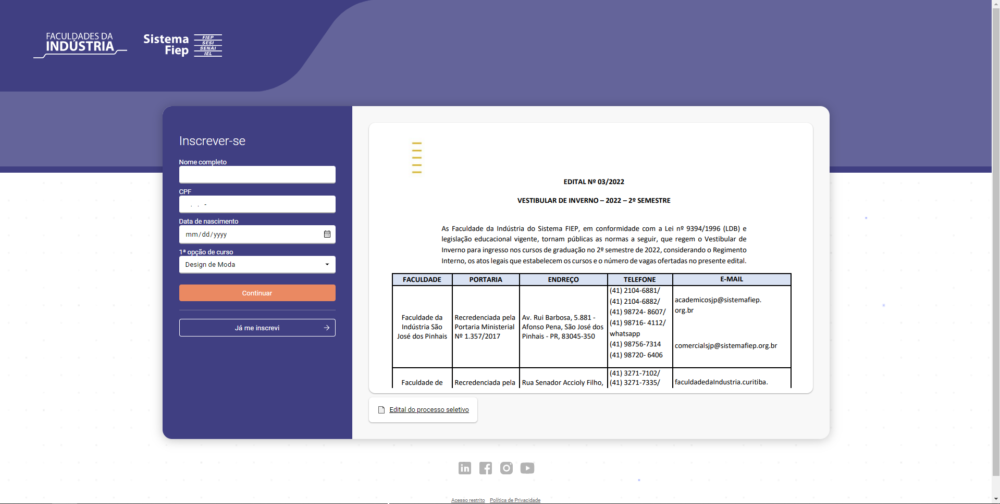
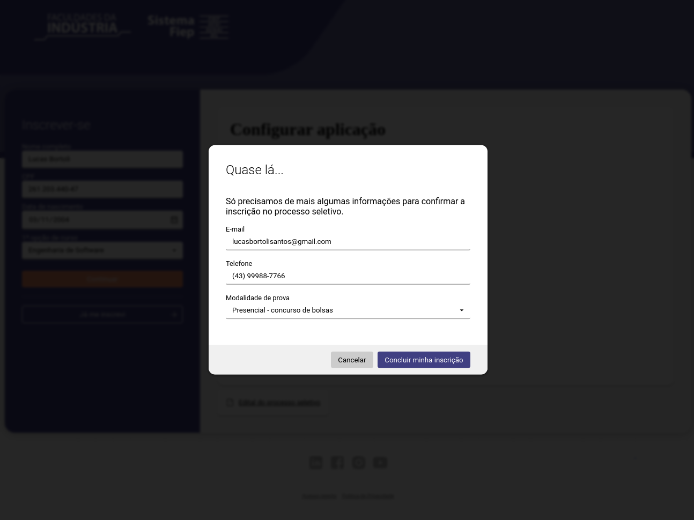
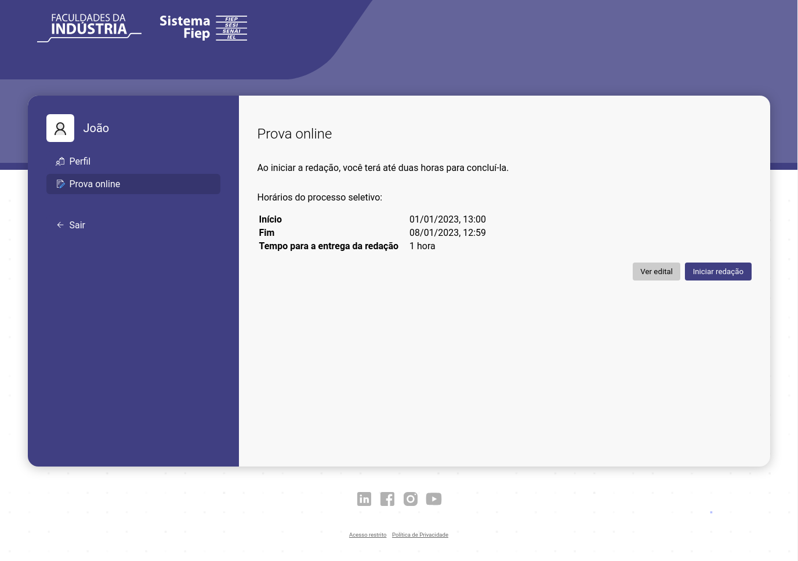
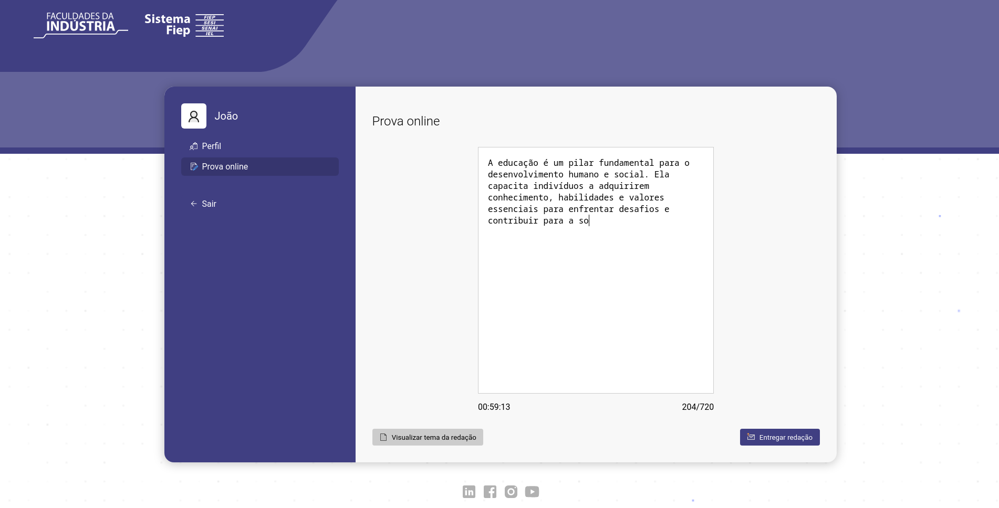
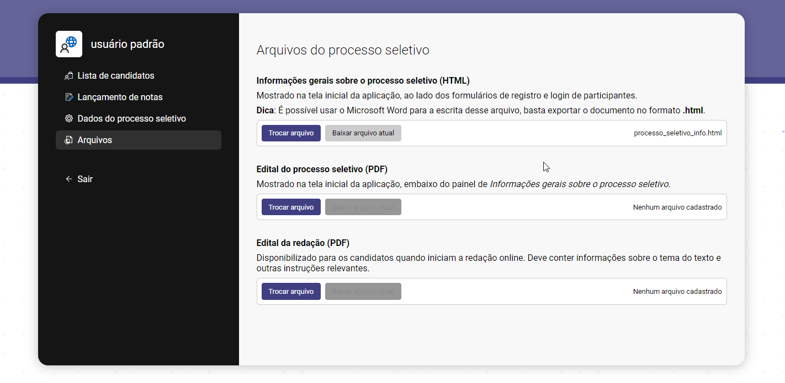

# Sistema de Vestibular - Faculdades da Indústria

Esse é o repositório do Sistema de Vestibular das Faculdades da Indústria. Este projeto foi desenvolvido para o estudo de caso de gerenciamento do vestibular.











## Stack Utilizada

O sistema foi desenvolvido utilizando as seguintes tecnologias:

- Linguagem: TypeScript
- Backend: Node.js
- Banco de Dados: SQLite
- Containerização: Docker

## Instruções de Execução

Certifique-se de ter o Docker instalado em sua máquina antes de prosseguir com as etapas abaixo:

1. Clone este repositório para o seu ambiente local.
2. Abra um terminal na pasta raiz do projeto.

Execute o seguinte comando para construir e executar os containers:

```bash
docker-compose up
```

O sistema será implantado e estará acessível através do seu navegador web no endereço `http://localhost:8000`.

## Credenciais de Acesso

Utilize as seguintes credenciais para acessar o sistema:

- Usuário: root
- Senha: 1234

Lembramos que estas são as credenciais padrão e é altamente recomendável que você as altere assim que possível por motivos de segurança.

## Configuração do banco de dados

Siga o arquivo [setup.md](./setup.md) para a configuração inicial do banco de dados.

## Contato

Se você tiver alguma dúvida ou problema em relação a este sistema, sinta-se à vontade para entrar em contato: lucasbortolisantos@gmail.com

Atenciosamente, \
Lucas Vinicius de Bortoli Santos
